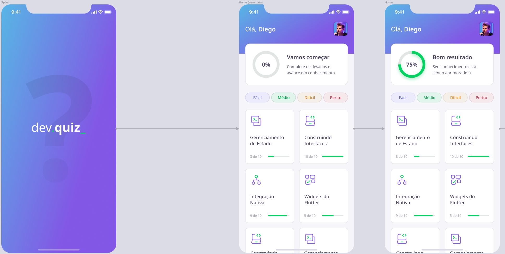

# Next Level Week #5 - Trilha Flutter

Este repositório contém o código da aplicação proposta pela NLW #5.

A aplicação consiste em um quiz com perguntas sobre o Flutter, no intuito de auxiliar o desenvolvedor em seus estudos.

O repositório terá uma branch para cada dia de aula, de forma que seja possível acompanhar a evolução do código em cada dia.

